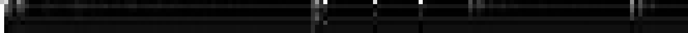

# Algorithmic Bias

[](https://gitter.im/KWoC-americast/algo-bias?utm_source=badge&utm_medium=badge&utm_campaign=pr-badge&utm_content=badge)

The aim of this project is to classify the income category people in a binary fashion as per their attributes. Next, we try to find out the factors which have contributed to the output of our model, at every layer, using a technique called [Layerwise Relevance Propagation (LRP)](http://heatmapping.org/). Three variants of the implementation have been presented in this project. `main.py` is PyTorch based and `tmain.py` is TensorFlow based. LRP is supported by `kmain.py` and `interprettensor/` which are in Keras (preferably through theano) and interprettonsor TF wrapper respectively. We also generate heatmaps for various layers against the input using the Keras variant.

## Setup

```
pip install theano innvestigate
```

The package `innvestigate` installs a variant of keras which needs a version of tensorflow which is currently unsupported. Hence, we use `theano` for this project. We adjust the `backend` parameter to Theano instead of Tensorflow accordingly at `~/.keras/keras.json`. For more information on how to do this, visit [here](https://stackoverflow.com/questions/47153429/how-to-change-the-backend-of-keras-to-theano).

## Understanding the Code

The Keras variant of this code is used to generate heatmap as PyTorch and Tensorflow are not supported yet. So we will describe the kmain.py here until then. The first step is to import all the necessary libraries and functions. Next we define Batch Size, Epochs and Learning Rate to aid us in the training process. Then we use the Keras Sequential function to define model layers. Why we chose this particular model architecture? We will provide an ablation study later in this README listing accuracies of various models. 

Next, we ask user for the choice to load previous saved model. Depending on which we load the model or train from beginning. We then ask user the choice to train or test. Depending on the selection, we load a csv file containing data to train or test. We then seperate attributes with target values, namely x_train and y_train. We then compile the model using Adam optimizer and Categorical Crossentropy as loss function. We use Keras' checkpoints to define early stopping (for training) if accuracy does not improve after certain epochs. Then depending on the user choice we train or test the model. If we train the model, then the best performing weights are saved to use them to load the model next time. 

If the user chose to test, we print the model accuracy on the test data. Next we do LRP, Layer-wise Relevance Propagation is a method for understanding deep neural networks by running a backward pass to observe how the individual layers of the program work. This technique brings brings explainability to Deep Neural Networks. More information on LRP is given [here](https://link.springer.com/chapter/10.1007/978-3-030-28954-6_10).
<p align="center">


<div align="center">
Source: heatmapping.org
</div>
</p>


Let us understand the code used to implement LRP using Innvestigate:


```python
# we use lrp.z here out of various methods available like 
# Saliency, Deconvnet, GuidedBackprop, SmoothGrad, and IntergratedGradient
# then we pass our model here
analyzer = innvestigate.create_analyzer("lrp.z", model)
# then we pass model inputs, that is x_train
analysis = analyzer.analyze(x_train)
```
Then we perform the layer wise layer analysis by blocking off the layers and then performing analysis on them. 

```python
# Here we cutoff the layers and define a new model. This will remove the last Dense layer.
new_model_1 = Model(model.inputs, model.layers[-3].output)
# model.get_weights() return a numpy list of weights
new_model_1.set_weights(model.get_weights())
# summarize the model
new_model_1.summary()
```
Then we perform the analysis on this new model:

```python
analyzer = innvestigate.create_analyzer("lrp.z", new_model_1)
analysis = analyzer.analyze(x_train)
# We save the results as numpy vectors
np.save("out_lrp", analysis)
```
We perform this method on every layers, meanwhile saving the numpy vectors.

Using this, we get layer by layer heatmaps in form of numpy vectors. In summary, we are cutting off layers in the network to obtain heatmap vectors for every layer and we are then merging them together to form a heatmap matrix/tensor. We use lrp_matrix.py to get complete numpy vectors then we plot them.

## Choosing Appropriate Model

We perforemed experiments with various model architecture to choose the right one. We present a table below stating the model architecture and accuracy. 

Dense layer : 'D', Batch Normalization: 'BN', Dropout: 'DR'
<div align='center'>

</div>

## Generating heatmaps

Next, we generate heatmaps using

```
python kmain.py
python lrp_matrix.py
python plot.py
```

Please make sure you run `kmain.py` in inference mode by answering the questions prompted accordingly.

## Sample heatmap


